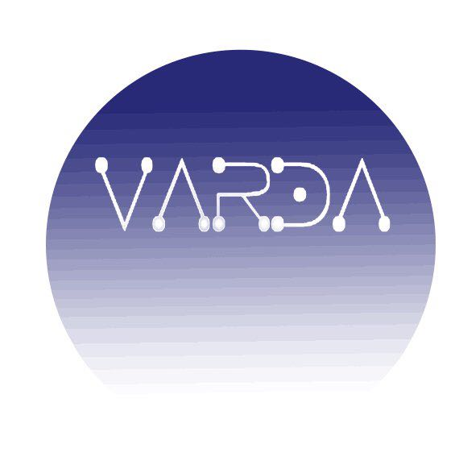

<h1 align=center> Varda </h1>

Varda(瓦尔达)，中土世界最美的维拉，繁星的缔造者。

Varda 引擎将做为区块链网络--星辰之海的动力之源泉，同时也将为区块链世界注入新的血液。

Varda is the most beautiful Valar of Middle Earth, the creator of stars.
Varda engine is the sea of stars' origin of power, at the same time, it will injecting new blood for blockchain's world.

Q: What are you doing now?

A: I am writting the consensus

## TodoList

* [x] a peer to peer network
* [x] a demo DAG network
* [x] make rules for adding stars to DAG network
* [ ] write consensus
* [ ] commission
* [ ] vote

  ## Note:

  an address' star should be include each other
